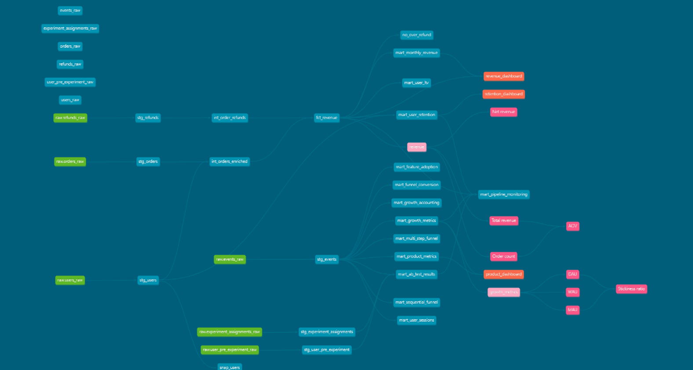
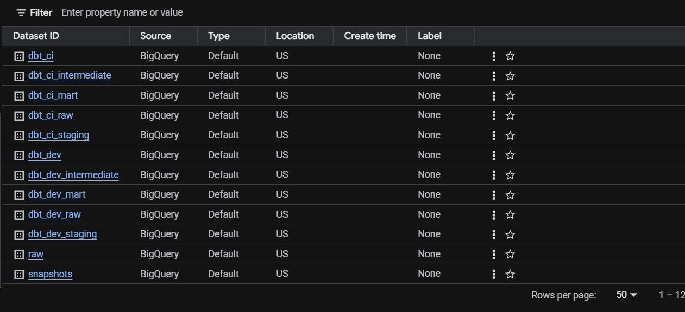
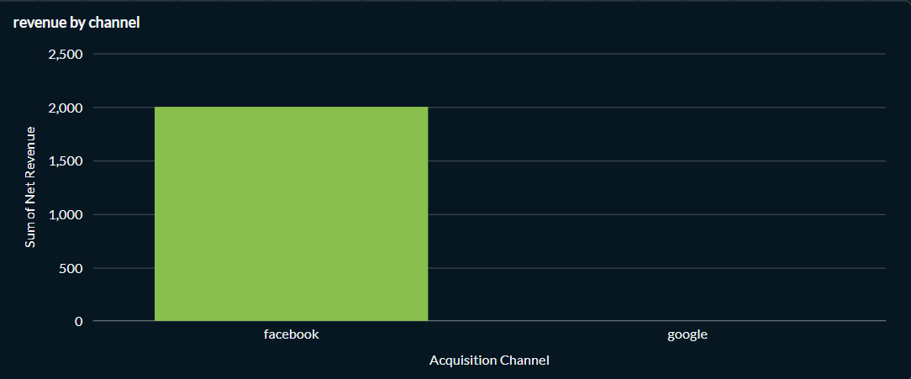
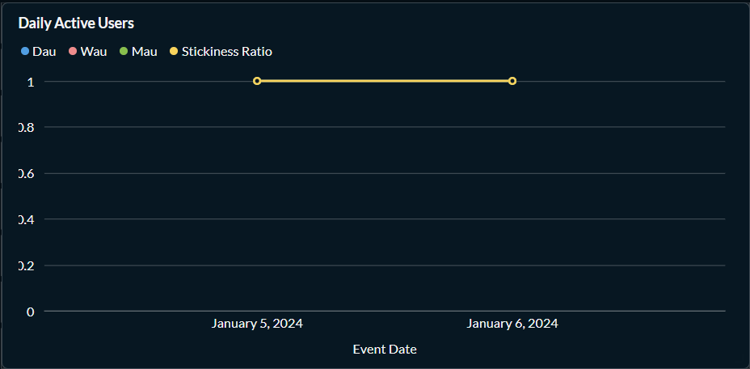
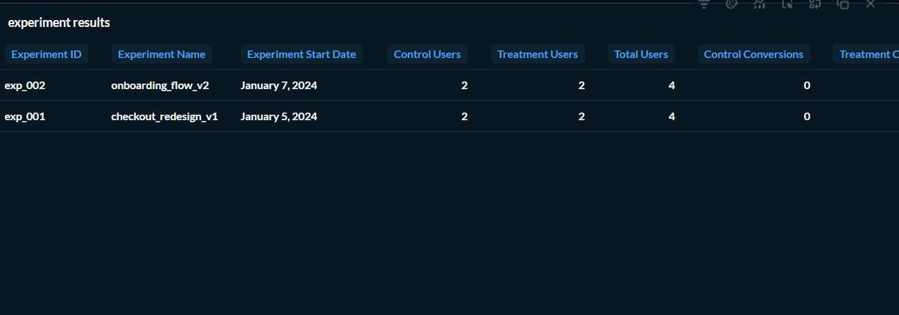

# Architecture

# BigQuery Warehouse Structure

# Revenue Dashboard

# DAU / WAU / MAU Dashboard

# Experimentation Dashboard

Production Analytics Warehouse — dbt + Google BigQuery
A production-grade analytics data warehouse built to simulate how real product companies structure their analytics platform. Every architectural decision is documented with business reasoning. Every model is tested. Every failure mode is known before it happens.

What This Is
This is not a tutorial project. It is an end-to-end analytics engineering system that answers the same questions a product team at a growth-stage startup asks every week:

How many users are active today, this week, this month — and is the product getting stickier?
Which user cohorts retain the best and what is each cohort worth over their lifetime?
Where are users dropping off in our purchase funnel?
Did our last experiment actually work — or did we just get lucky?
Is the pipeline healthy — or is our DAU chart wrong because the data stopped flowing?

Tech Stack
LayerToolCloud WarehouseGoogle BigQueryTransformationdbt-core + dbt-bigquerySemantic LayerMetricFlow (dbt)Data Qualitydbt_expectations + dbt_utilsOrchestrationPrefectVersion ControlGit + GitHubVisualizationPower BI

Architecture
Raw Layer (dbt seeds — simulated production data with real-world messiness)
    ↓
Staging Layer (cleaning, deduplication, standardization — one source of truth)
    ↓
Intermediate Layer (business logic, enrichment, reusable joins)
    ↓
Fact Table (fct_revenue — order-level grain, net revenue after refunds)
    ↓
Mart Layer (9 product analytics models — each answers specific business questions)
    ↓
Semantic Layer (MetricFlow — 8 metrics defined once, consistent across all tools)
Each layer has one responsibility and one reason to change. Cleaning happens in staging and nowhere else. Business logic lives in intermediate so it is not duplicated across marts. Metrics are defined once in MetricFlow so every tool gets the same number.

Models — 22 Total
Staging (4 models)
ModelWhat it doesstg_usersDeduplicates via ROW_NUMBER(), standardizes signup timestamps to UTCstg_ordersCleans currency inconsistencies, normalizes order status, handles NULL amounts with COALESCEstg_eventsParses event stream, casts timestamps, deduplicates by event_idstg_refundsAggregates refund amounts per order, handles partial refunds
Intermediate (2 models)
ModelWhat it doesint_orders_enrichedJoins orders with user attributes — country, acquisition channel, signup cohortint_order_refundsAggregates total refunded amount per order for fact table join
Fact (1 model)
ModelGrainKey decisionfct_revenueOne row per orderNet revenue = order_amount - total_refund_amount. Designed as incremental with 3-day lookback for late-arriving refunds
Marts (9 models)
ModelBusiness question answeredmart_growth_metricsDAU, WAU, MAU, stickiness ratio — is the product getting more engaging?mart_growth_accountingDAU decomposed into New + Retained + Resurrected users — what DAU hidesmart_user_retentionCohort retention — which signup cohorts return month after month?mart_user_ltvLifetime revenue per user — which users are worth the most?mart_feature_adoptionFeature usage rate — are users actually using what we build?mart_multi_step_funnelConversion rates at each funnel step — where do users drop off?mart_sequential_funnelStrict-order funnel — did users complete the journey in sequence?mart_user_sessionsSessionization using 30-minute inactivity gap — how do users engage per visit?mart_ab_test_resultsFull experimentation analytics — see experimentation section belowmart_pipeline_monitoringHealth status of all critical models — is the data trustworthy right now?
Semantic Layer (MetricFlow)
8 metrics defined as single source of truth — every tool gets the same number:
daily_active_users · weekly_active_users · monthly_active_users · dau_mau_stickiness · total_net_revenue · total_revenue · order_count · average_order_value

Experimentation Analytics — mart_ab_test_results
This model goes beyond basic conversion rate calculation. It handles what most analytics teams get wrong:
Sample Ratio Mismatch Detection
If the control/treatment split deviates more than 5% from 50/50, the experiment is flagged as invalid. SRM means assignment is broken and results cannot be trusted regardless of what the numbers show.
Statistical Significance (Two-Proportion Z-Test)
Z-score > 1.96 = significant at 95% confidence. Computed per experiment. Not just p < 0.05 — actual z-score so analysts can see how close to the boundary each result is.
CUPED Variance Reduction
Pre-experiment user behavior is used to adjust experiment-period metrics. This is the technique used by Airbnb, Netflix, and Microsoft to reduce required sample size by 30-50% — cutting experiment duration in half. Theta is calculated as covariance(Y, X) / variance(X) where X is pre-experiment conversion rate.
Duration Validation
Experiments under 7 days are flagged. Weekly seasonality has not been captured. Novelty effects have not worn off. Results from short experiments are unreliable.
Both absolute and relative lift computed per experiment. PMs think in relative. Statisticians think in absolute. Both are provided.

Data Quality — 80 Tests
Three categories of tests covering different failure modes:
Structural tests — not_null, unique — catch pipeline failures. Did data arrive? Is the primary key intact?
Business logic tests (dbt_expectations) — value ranges, allowed value sets, row count bounds — catch calculation errors. A conversion rate of 1.5 passes a not_null test but fails a range test. This is the difference between testing that data exists and testing that data is correct.
Model contracts — enforced on fct_revenue and stg_orders — catch breaking changes at compile time. If a column is renamed, the contract fails before any downstream model breaks.
bashdbt test
# Expected output: Done. PASS=80 WARN=0 ERROR=0

Architecture Decisions
Every non-obvious decision is documented in DECISIONS.md. Examples:
Why SCD Type 2 for snap_users?
User country changes over time. Without SCD2, a January cohort analysis run today shows current country — not January country. Historical cohort accuracy requires preserving the full attribute history.
Why deduplication in staging and not raw?
Cleaning happens once at the boundary of trust. Downstream models reference staging, not raw. If deduplication logic changes, it changes in one place.
Why table materialization for fct_revenue?
BigQuery free tier restricts DML operations (MERGE, INSERT, UPDATE) required by incremental models. Production design: incremental with partition_by=order_date, cluster_by=user_id, 3-day lookback for late-arriving refunds.
Why MetricFlow over mart-level metric definitions?
When DAU is defined in six different marts, six teams can get six different answers. MetricFlow defines it once. Every tool gets the same number.

Known Failure Modes
Documented in FAILURE_MODES.md — production failures identified before they occurred:
FailureTypeDetectionSource data stops arrivingSilent — pipeline succeeds, DAU shows zeroSource freshness checks (designed, not implemented on static seeds)Source column renamedLoud — compilation errorModel contracts on staging layerDeduplication nondeterminismSilent — wrong record selected, no errorSecondary sort column needed on identical timestampsTimezone misattributionSilent — ~30-90 min of events per day on wrong dateCAST with AT TIME ZONE 'Asia/Kolkata'Experiment assignment contaminationSilent — conversion rates wrong for both groupsUnique test on (user_id, experiment_id)

Pipeline Monitoring
mart_pipeline_monitoring runs as part of every pipeline execution. It tracks:

Row counts for all critical models
Latest data date per model
Health status: OK / WARNING (low rows) / CRITICAL (empty table)

This catches silent failures before a PM notices wrong numbers in a dashboard.

BigQuery Migration Notes
Project migrated from PostgreSQL to BigQuery. Real dialect differences encountered and fixed, documented in MIGRATION_NOTES.md:
IssuePostgreSQLBigQueryCast syntaxcol::dateCAST(col AS DATE)Moduloa % bMOD(a, b)Date truncationDATE_TRUNC('month', col)DATE_TRUNC(col, MONTH)Conditional countCOUNT(*) FILTER (WHERE...)COUNTIF(...)DML restrictionsSupportedRequires billing on free tier

Scale Considerations
Documented in SCALE_NOTES.md — what changes at 100x volume:

fct_revenue at 500M rows — partition by order_date + cluster by user_id reduces scan cost ~95% for date-range queries
mart_user_retention at 10M users — pre-aggregate at intermediate layer before cohort cross join
Prefect pipeline — needs retry logic, SLA monitoring, Slack alerting for 3am failures

Running the Project
bash# Install dependencies
pip install dbt-bigquery dbt-core

# Configure BigQuery credentials in ~/.dbt/profiles.yml

# Load raw data
dbt seed

# Run all transformations
dbt run

# Run 80 data quality tests
dbt test

# Generate documentation
dbt docs generate
dbt docs serve

Documentation Files
FileContentsDECISIONS.mdArchitecture decisions with business reasoningFAILURE_MODES.md5 production failure scenarios with detection gapsSCALE_NOTES.mdWhat changes at 100x data volumeMIGRATION_NOTES.mdPostgreSQL → BigQuery dialect differencesSEMANTIC_LAYER_NOTES.mdMetricFlow design decisionsEXPERIMENTATION_NOTES.mdA/B testing, CUPED, peeking problem notesPRODUCT_ANALYTICS_NOTES.mdGrowth frameworks and metric decompositionOBSERVABILITY_NOTES.mdPipeline monitoring design

What I Would Do Differently in Production

Real data ingestion — Fivetran or Airbyte instead of static seeds. Seeds simulate loading but do not teach schema drift or incremental ingestion patterns.
Enable incremental on fct_revenue — requires BigQuery billing. Config already written.
Connect Metabase or Looker — the analytics engineering value chain ends at the BI tool. Understanding how analysts consume models shapes better mart design.
Elementary observability — automated anomaly detection on model row counts and metric distributions. Requires billing.
Snowflake — many Indian product companies use Snowflake. Same dbt concepts, different cost model.

Author
Abhay Singh Jamwal
BTech Computer Science · NIMS University, Jaipur · 2027
Analytics Engineering | dbt · BigQuery · SQL · MetricFlow · Experimentation Analytics
LinkedIn · GitHub
